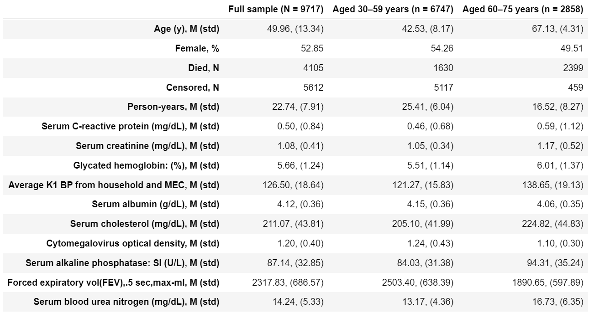

# Modeling Rate Of Senescence
This repository contatins reproduction of the paper of Levine, M. E. (2012). **Modeling the Rate of Senescence: Can Estimated Biological Age Predict Mortality More Accurately Than Chronological Age?** The Journals of Gerontology Series A: Biological Sciences and Medical Sciences, 68(6), 667–674. [doi:10.1093/gerona/gls233](https://pubmed.ncbi.nlm.nih.gov/23213031/)

Notes and modifications:
- In the paper, NHANES III dataset (1988-1994) was used which is available by the [link](https://wwwn.cdc.gov/nchs/nhanes/nhanes3/datafiles.aspx)
- In the original paper, variable "Cytomegalovirus optical density" was used, and this variable is not available in current version of NHANES III for all people (only for women) so I replaced it with variable CVP_IGG from "Antibody to Cytomegalovirus IgG and IgM" surplus dataset
- In the original paper, 2006 Mortality Data was used which is archived and not available now so I used current version of [2019 Linked Mortality Files](https://www.cdc.gov/nchs/data-linkage/mortality-public.htm)

# Sections of the Jupyter Notebook ModelingRateOfSenescence.ipynb

## 1. Reading NHANES III datafiles (lab.dat, exam.dat, adult.dat, cmv.xpt, NHANES_III_MORT_2019_PUBLIC.dat)
Datafiles have specific format - each line of ```.dat``` file correspond to a participant, there is some sequence of numbers, blanks or repeating 8, 9 etc in each line. In corresponding ```.sas``` files, there is description which variables correspond to which indices in the line. I collected all the indices of variables used in the article in this notebook section.

## 2. Data aggregation 
In this section all dataframes from ```.dat``` and ```.xpt``` are merged by SEQN variable (participant's ID). Resulting dataframe is filtered by Age (30-75 y.o.), Pearson's correlations between Chronological age and variables are calculated, 10 best variable are chosen. Rows containing NaNs are dropped.

Resulting dataframe was saved for reproducible results:

Columns in the ```data/df.csv``` are:

**SEQN**: participant's ID
<br>**HSAGEIR**: Age
<br>**HSSEX**: Sex (1: Male, 2: Female)
<br>**MORTSTAT**: Final status (0: Alive or censored, 1: Died)
<br>**PERMTH_EXM**': Time spent from examination to MORTSTAT Event
<br>**CRP**: Serum C-reactive protein (mg/dL)
<br>**CEP**: Serum creatinine (mg/dL)
<br>**GHP**: Glycated hemoglobin: (%)
<br>**HAZMNK1R**: Average K1 BP from household and MEC
<br>**AMP**: Serum albumin (g/dL)
<br>**TCP**: Serum cholesterol (mg/dL)
<br>**CVP_IGG**: Cytomegalovirus optical density
<br>**APPSI**: Serum alkaline phosphatase:  SI (U/L)
<br>**SPPFEV05**: Forced expiratory vol(FEV),.5 sec,max-ml
<br>**BUP**: Serum blood urea nitrogen (mg/dL)

## 3. Analysis
**Tables 1, 2** are reproduced. Note that I have got slighly different number of participants and Pearson's R values - I suppose the dataset was slighly modified from the time when article was published. 

Original Table 1           |  Reproduced Table 1   
:-------------------------:|:-------------------------:
  |  


Original Table 2           |  Reproduced Table 2   
:-------------------------:|:-------------------------:
  |  

## 4. Bilogical Age estimates

### 4.1 Principal component analysis (PCA)
First PCA component was used as Biological Age estimator. Note that authors used some undefined method to investigate the significance of variable's influence on the first principal component and chose 7 statistically significant variables based on that to test Biological Age models with limited number of Biomarkers. I tested variable's influence on the first PCA by Pearson's correlation - and all 10 biomarkers significantly correlated with the first PCA so I did not reproduce their limites models.
### 4.2 Multiple linear regression (MLR)
MLR was used to predict Chronological Age from the 10 Biomarkers. Resulting MLR predictions are Biological Age estimations.
### 4.3 Klemera and Doubal’s method (KDM)
The formulas (2), (3), (4) and (5) from the paper implemented. Note, that in formulas: $x_j$ is a set of biomarker values, $k_j$ is a slope, $q_j$ is intercept, $s_j$ i a root mean squared error of a biomarker regressed on chronological age, $m$ is number of biomarkers used.

**Table 3** is reproduced.

Original Table 3           |  Reproduced Table 3   
:-------------------------:|:-------------------------:
  |  

## 5.Bilogical Age estimates and mortality
Mortality risk was the last available value of cumulative hazard function (```cph.predict_cumulative_hazard(Cox_train)```) or inverse of survival function (```1-cph.predict_survival_function(Cox_train)```). These approaches to define mortality risk are identical and result in identical ROC-AUC curves and ROC-AUC scores.

## 6. ROC-AUC stratified by age groups
**Tables 4, 5** are reproduced.

Original Table 4           |  Reproduced Table 4   
:-------------------------:|:-------------------------:
  |  

Original Table 5           |  Reproduced Table 5   
:-------------------------:|:-------------------------:
  |  
